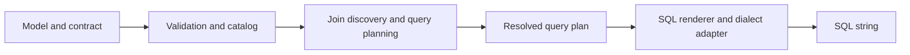

# Query contract to SQL

A small deterministic compiler for the [Walt assessment](Takehome_Query_Contract_to_SQL.pdf).
It turns a semantic model and a query contract into executable **DuckDB or PostgreSQL SQL**.
Contracts A, B, and C use the same validation, join discovery, and query planner for both
databases. Dialect adapters handle SQL syntax differences.

## Setup and run

Python 3.12+ and [uv](https://docs.astral.sh/uv/) are required. uv creates `.venv`, installs
the project, and manages all dependencies using the committed `uv.lock`.

```sh
uv sync --locked
```

Run all three contracts against a fresh, in-memory DuckDB database:

```sh
uv run python -m query_compiler demo
```

Show the generated SQL as well:

```sh
uv run python -m query_compiler demo --show-sql
```

Create a persistent database with the assessment dataset, then run the demo against it:

```sh
uv run python -m query_compiler demo --database data/assessment.duckdb
```

The first run creates the file and loads the fixtures in a transaction. Later runs open
the existing file read-only and preserve its data. Add `--show-sql` to inspect the queries.
The database file is excluded from Git. Other Python code can open it with
`duckdb.connect("data/assessment.duckdb")`.

Run just one contract against the persistent database:

```sh
uv run python -m query_compiler demo --database data/assessment.duckdb --contract a
```

Choose `a`, `b`, or `c` (uppercase is also accepted). Omit `--contract` to run all three.
Add `--show-sql` to see the selected contract's SQL.

### Run a custom contract

Save your input as a JSON file, then run it against an existing database:

```sh
uv run python -m query_compiler run \
  --contract examples/revenue_by_region_2026.json \
  --database data/assessment.duckdb \
  --show-sql
```

The included example asks for 2026 revenue by region plus a total: North 250, South 370,
West 90, Total 710. Use any file path with `--contract`; the file must use the supported
contract vocabulary and names declared in the semantic model.

The assessment semantic model is used by default. Pass `--model path/to/model.json` to
supply your own declarations. The database must already contain the matching tables and
columns: this command opens it read-only and does not create tables or insert sample data.
Unsupported contracts fail with a named error; database failures use `DatabaseExecutionError`.

Run tests, lint, and the generation benchmark:

```sh
uv run pytest
uv run ruff check .
uv run ruff format --check .
uv run python -m query_compiler benchmark --iterations 5000 --output benchmarks/duckdb.json
```

DuckDB needs no external database server. PostgreSQL SQL generation also works without a
server; PostgreSQL execution requires an existing server and the optional driver below.
The initial `uv sync` downloads dependencies; compilation itself performs no network I/O.

Compile your own JSON files:

```sh
uv run python -m query_compiler compile \
  --model src/query_compiler/fixtures/semantic_model.json \
  --contract src/query_compiler/fixtures/contract_b.json \
  --dialect duckdb
```

## PostgreSQL

Use `--dialect postgres` (or `postgresql`) to generate PostgreSQL SQL:

```sh
uv run python -m query_compiler compile \
  --model src/query_compiler/fixtures/semantic_model.json \
  --contract examples/revenue_by_region_2026.json \
  --dialect postgres
```

To execute queries, install the optional psycopg driver with uv:

```sh
uv sync --locked --extra postgres
```

Supply a PostgreSQL connection string with `--dsn`, or set `QUERY_COMPILER_POSTGRES_DSN`.
For example, assuming a local database named `walt` exists and authentication is configured:

```sh
uv run --extra postgres python -m query_compiler demo \
  --dialect postgres --dsn 'postgresql://localhost/walt' --contract b --show-sql
```

The PostgreSQL demo creates the assessment fixtures in temporary tables scoped to its
connection. Its search path is restricted to the temporary schema, and the tables disappear
when the connection closes. It can run A, B, C, or all three, without replacing existing tables.

Run a custom contract against tables already present in your PostgreSQL database:

```sh
uv run --extra postgres python -m query_compiler run \
  --dialect postgres \
  --dsn 'postgresql://localhost/walt' \
  --contract examples/revenue_by_region_2026.json \
  --show-sql
```

Add `--model path/to/model.json` for a custom semantic model. `run` starts a read-only
transaction and performs no fixture loading. PostgreSQL connection settings can select the
schema through `search_path`; model identifiers refer to tables visible in that path.
`--database` is reserved for DuckDB file paths; PostgreSQL uses `--dsn` or the environment
variable. The optional dependency installs the client driver, not a PostgreSQL server.

Benchmark SQL generation without connecting to PostgreSQL:

```sh
uv run python -m query_compiler benchmark --dialect postgres \
  --iterations 5000 --output benchmarks/postgres.json
```

## Public API

```python
from query_compiler import compile_sql

sql = compile_sql(semantic_model, contract, "duckdb")
postgres_sql = compile_sql(semantic_model, contract, "postgres")
```

Inputs are already parsed JSON-compatible dictionaries. The function validates both inputs,
builds the model index, resolves the contract, and renders SQL on every call. It performs no
file I/O, database inspection, network/LLM calls, or caching, and does not mutate its inputs.
Database drivers are imported only by the execution commands and tests, not by the compiler.

## Assessment results

**A:** `online_rev = 420`, `total_revenue = 710`.

**B:**

| Region | Revenue 2025 | Revenue 2026 | Delta | Percent change |
|---|---:|---:|---:|---:|
| North | 100 | 250 | 150 | 150.0% |
| South | 200 | 370 | 170 | 85.0% |
| West | 150 | 90 | -60 | -40.0% |
| Total | 450 | 710 | 260 | 57.8% |

**C:** North 4, South 3, West 2, **total 8**. Order O-203 occurs in two regions.

The SQL returns numeric percentage points: North's percentage change is `150.0`, not `1.5`.
The demo adds `%` and rounds to one decimal; SQL preserves the calculated precision.
Reviewed SQL examples are in [tests/snapshots](tests/snapshots).

## Architecture and rationale



| Module | Responsibility |
|---|---|
| `compiler.py` | Public function; orchestrates all stages. |
| `validation.py`, `model.py` | Strict input validation and a declared semantic catalog. |
| `planner.py` | Resolve names, discover necessary joins, and expand comparison outputs. |
| `plan.py` | Immutable dataclasses for resolved columns, predicates, aggregates, and outputs. |
| `renderer.py` | Render the planned aggregation, projection, and ordering. |
| `dialects.py` | Quote identifiers, escape literals, render casts and filtered aggregates. |
| `execution.py` | Optional PostgreSQL connections and read-only execution configuration. |
| `errors.py` | Public named errors. |

Python dataclasses and a small renderer keep the supported vocabulary visible and easy to
explain. A general SQL parser or optimizer would not decide the key semantic questions here:
filter scope, safe joins, aggregation grain, or how totals behave. DuckDB is the execution
dependency; psycopg is the optional PostgreSQL driver. pytest and Ruff are development
dependencies, and pglast checks emitted SQL using PostgreSQL's parser. All are locked by uv.
Neither pglast nor psycopg participates in SQL generation.

### Dialect boundary

`SQLDialect` contains the SQL constructs shared by both engines. `DuckDBDialect` retains
the original DuckDB output. `PostgresDialect` renders text casts as `TEXT`, escapes string
literals with explicit `E'...'` syntax, and rejects identifiers longer than 63 UTF-8 bytes
instead of letting PostgreSQL silently truncate them. The escape syntax preserves backslashes
regardless of `standard_conforming_strings`. See
[PostgreSQL lexical syntax](https://www.postgresql.org/docs/current/sql-syntax-lexical.html).

Both engines support filtered aggregates and grouping sets, so the contract planner and
aggregation strategy stay shared. The fixture uses `DOUBLE PRECISION`, accepted by both
engines. PostgreSQL may return exact decimal values for percentage arithmetic on integer
metrics; the CLI displays these using the same one-decimal percentage convention.

### Join discovery and preservation of facts

The planner gathers dependencies from grouping, all filters, metrics, and comparison fields.
It traverses the declared directed many-to-one graph. A topological pass counts paths,
saturating at two, so ambiguity detection does not enumerate exponentially many paths.
Only the required unique paths become joins. An intermediate dimension can be joined even
if it contributes no selected field. Join edges are reused and ordered deterministically.

All dimension attachments use `LEFT JOIN`. Missing dimension rows therefore do not remove
facts. Global filters go in `WHERE`, so a requested `region = 'North'` genuinely restricts
facts; it also excludes unmatched stores. Putting that restriction only in the join's `ON`
clause would leave unwanted facts in the aggregate.

Per-metric filters go inside the aggregate's `FILTER (WHERE ...)` clause. In A, the channel
predicate affects online revenue, while the fiscal-year predicate restricts the shared input.
The same distinction applies to per-metric filters on joined dimensions.

The calendar join uses the declared `order_date` relationship. No shipping-date relationship
is invented. The fixture setup includes shipping dates in the calendar because the PDF asks
for every date but its calendar inserts list only order dates. This setup repair does not
change any expected assessment results.

### Totals and comparison arithmetic

For grouped queries requesting a grand total, the aggregate stage uses:

```sql
GROUP BY GROUPING SETS ((region), ())
```

Every aggregate is evaluated directly at detail grain and total grain. `SUM` remains correct,
and `COUNT(DISTINCT order_id)` is recomputed over all applicable facts. Distinct counts are
never summed from region rows. The model's declared measure class must match the supported
aggregate; this implementation uses base-grain aggregation for both classes.

Comparisons create a filtered aggregate for each metric/period. An outer query then computes
primary minus baseline and percentage change from each row's own cells. This applies to the
grand total too. A metric's local filters and its period predicate are combined with `AND`.

`GROUPING` distinguishes a generated total from an actual null-valued group. The total is
labeled `Total` in the first grouping column; other grouping columns are null on that row.
To accommodate that label without type metadata, **grouping output columns are cast to text
when grand totals are requested**. Without totals, grouping columns retain their native types.
The total sorts last; detail rows sort by native grouping values, with nulls last.

### Determinism

The compiler uses fixed formatting, stable catalog traversal, and stable internal aliases.
Model declaration order and JSON object key order do not affect the generated SQL. Meaningful
contract list order is retained: metrics, grouping fields, comparison periods, and requested
outputs. SQL contains no timestamps, random IDs, environment-derived values, or Python hashes.

Tests compare exact SQL bytes across repeated calls and fresh processes with different hash
seeds. Result ordering is explicitly rendered, separately from SQL-string determinism.

## Supported vocabulary and explicit policies

- One metric source dataset per query, with simple column-reference expressions.
- `sum` / `additive` and `count_distinct` / `distinct_count` metrics; metric aliases.
- Declared dimensions; zero or more grouping fields.
- Global and per-metric equality filters, combined with `AND`. Filter fields must be declared
  dimensions and their supplied model must match. Values may be strings, finite numbers,
  or booleans; integer literals must fit in signed 64 bits. Null equality is rejected.
- Exactly two distinct string comparison periods and a primary period from that pair.
  Outputs may be any nonempty subset of `values`, `delta`, and `pct_change`, in requested order.
- Comparison dimensions are cast to text for period matching. This explicitly accommodates
  the PDF's string periods and integer fiscal-year column without guessing warehouse types.
- Comparison restricts the shared input to the requested periods; global filters still apply.
  Groups present only in an unrequested period do not appear.
- Missing-period and all-null sums remain `NULL`. Distinct counts use normal SQL behavior:
  zero for no matching rows, excluding null order IDs. Derived arithmetic propagates nulls.
- A zero baseline produces `NULL` percentage change, using `NULLIF`.
- `totals: "grand"` is supported. Omit `totals` for no totals. Without grouping, a grand-total
  request returns the single aggregate row, without duplication.
- Unknown keys are rejected, including typos. Dataset/column identifiers are restricted to
  simple ASCII identifiers; output aliases may contain spaces or quotes and are safely quoted.
  Case-insensitive output-name collisions, including generated comparison aliases, are rejected.

### Honest failures and boundaries

All expected compilation failures inherit `QueryCompilerError`. Examples include
`UnknownMetricError`, `UnknownDimensionError`, `InvalidContractError`, `InvalidFilterError`,
`InvalidSemanticModelError`, `NoJoinPathError`, `AmbiguousJoinPathError`,
`UnsupportedRelationshipError`, `UnsupportedFeatureError`, and `UnsupportedDialectError`.
The CLI prints the named error and exits with status 2.

Errors carry the relevant input location or relationship names, for example:

```text
InvalidFilterError: filters[0]: field 'region' belongs to dim_store, not fact_sales
```

The compiler trusts declared cardinality and grain. It cannot detect a warehouse violating
those declarations, verify that physical columns exist, or perform full field-type checking
because the supplied model has no column types. These would require richer metadata or a
separate model-validation workflow. No physical schema is inferred from the test database.

Unsupported features include multiple fact datasets, relationship cycles/self-joins,
cardinalities other than many-to-one, ambiguous role-playing joins, arbitrary SQL expressions,
non-equality predicates, HAVING, trend bucketing, subtotals, and grouping by the comparison
dimension in the same request. Unsupported declarations also fail model validation even if
the current contract would not use them, except join ambiguity is checked for required paths.

A real dimension value named `Total` retains that name; the generated total is distinguishable
by its guaranteed final position. A richer output contract should expose an explicit total
flag to consumers that do not preserve result order.

## Tests

The suite shares assessment-result and boundary tests between DuckDB and PostgreSQL, including:

- Orphan-store/calendar facts, null grouping values, and genuine global dimension restrictions.
- Local dimension filters that leave other metrics unchanged.
- Distinct totals with overlapping groups, including comparisons of distinct counts.
- Missing periods, zero baselines, empty input, null measures, and comparison output ordering.
- Multi-hop joins, renamed physical tables/columns, unsafe or ambiguous relationships.
- Quoted aliases, apostrophes and SQL-looking literal values, malformed inputs, and named errors.
- SQL snapshots, non-mutation of inputs, fresh-process determinism, and the runnable CLI.

PostgreSQL parsing, snapshot, identifier-limit, and determinism tests run without a server.
To enable actual PostgreSQL execution tests, point the test suite at a dedicated test database:

```sh
export QUERY_COMPILER_TEST_POSTGRES_DSN='postgresql://localhost/walt_test'
uv run --extra postgres pytest
```

Without that variable, only server-dependent PostgreSQL tests are skipped. PostgreSQL
integration tests use temporary tables, plus isolated test schemas for checking cross-process
execution and fixture isolation; the test account needs temporary-table and schema-creation
permissions. The test schemas are cleaned up. String escaping is checked with PostgreSQL's
`standard_conforming_strings` setting both on and off, and read-only execution is verified.

Validation completed with **177 tests passed**, including actual execution against
**PostgreSQL 16.15** and DuckDB 1.5.5. Ruff lint and formatting checks also pass.

## Performance

The benchmark measures the complete `compile_sql` call, including model validation/indexing,
contract resolution, join planning, and rendering. Fixture-file loading and JSON decoding
happen before measurement; database execution is excluded. It performs no result caching.
The first observed call for each contract is recorded separately, followed by warm-up and
thousands of measured calls. Only A's first observed call is the first compilation overall
in the process. Median, p95, maximum, and the count at or above 10 ms are reported.

Measured on an Intel Core i7-1360P under WSL2, Python 3.12.3, with 100 warm-up calls and
5,000 measured calls per contract and dialect:

| Dialect | Contract | First observed (ms) | Median (ms) | p95 (ms) | Maximum (ms) |
|---|---|---:|---:|---:|---:|
| DuckDB | A | 0.193 | 0.064 | 0.083 | 1.279 |
| DuckDB | B | 0.163 | 0.078 | 0.103 | 0.997 |
| DuckDB | C | 0.090 | 0.057 | 0.074 | 0.871 |
| PostgreSQL | A | 0.212 | 0.067 | 0.090 | 0.786 |
| PostgreSQL | B | 0.146 | 0.085 | 0.116 | 0.996 |
| PostgreSQL | C | 0.099 | 0.061 | 0.079 | 1.137 |

No measured call reached 10 ms. Full reports are in
[benchmarks/duckdb.json](benchmarks/duckdb.json) and
[benchmarks/postgres.json](benchmarks/postgres.json). Measurements describe this development
environment, not a universal latency guarantee.

## Extensions and remaining assessment work

**Solution shape and rationale:** a deterministic compiler pipeline validates the model and
contract, resolves names and joins, builds an immutable typed query plan, and renders SQL
through a dialect adapter. This separates semantic decisions from SQL syntax, so DuckDB and
PostgreSQL share filter scope, comparison, and total behavior. Small dataclasses and a custom
renderer fit the deliberately narrow vocabulary and make each stage easy to inspect and test.
The public `compile_sql` boundary needs no database connection or external service.

**Further dialects:** implement another dialect adapter and register it in `get_dialect`,
with execution/syntax tests for the target engine. If its aggregation capabilities differ,
add an explicit capability check or a plan transformation rather than changing contract meaning.

**Adding HAVING without a rewrite:** extend contract validation with aggregate predicates,
resolve their metric references in the planner, add a typed predicate node to `plan.py`, and
render it at the post-aggregation stage. Reuse the existing catalog, join discovery, and
aggregate construction. Decide whether totals describe all input facts or only surviving
groups; filtering detail rows can require a different totals plan. Add execution tests for
both dialects covering totals, local metric filters, and comparison outputs, while retaining
the existing SQL snapshots for contracts without HAVING.

**Adding a month-by-month trend:** add declared time-grain metadata, a typed bucketing
expression, and a dialect method for date bucketing. The planner would use that expression
as a grouping key, reusing existing join discovery and aggregation. Use only declared date
relationships and fields. Define time-zone and missing-month behavior first; showing empty
months would need a calendar-spine plan step. Test year boundaries and empty months in both
dialects, keeping existing column-based grouping behavior intact.

**Second fact table:** aggregate each fact independently to a compatible grain before
combining results. Raw fact-to-fact joins can multiply measures. Define shared-dimension and
missing-group semantics first; until then, refuse the request.

**What breaks first with 10× the vocabulary:** the likely first limit is correctness and
maintainability of validation combinations and planner branches, especially interactions
between filters, comparisons, time grains, and totals. Introduce explicit feature
capabilities and focused transformation passes over a richer typed plan, supported by a
semantic test matrix. Keep unsupported combinations as named errors. The relationship pass
already avoids enumerating paths; if model size also grows, profile validation and indexing
before introducing a versioned, reusable model index. More vocabulary alone does not justify
caching generated SQL.

**Measured generation times:** the committed runs measured 5,000 full, uncached `compile_sql`
calls per contract and dialect after 100 warm-up calls, using Python 3.12.3 on an Intel Core
i7-1360P under WSL2. DuckDB median times for A/B/C were **0.064 / 0.078 / 0.057 ms**;
PostgreSQL medians were **0.067 / 0.085 / 0.061 ms**. Across both dialects, p95 was at most
**0.116 ms**, and the largest measured call was **1.279 ms**; none reached 10 ms. These times
include validation, indexing, planning, and rendering, but exclude JSON loading and database
execution. See [Performance](#performance) for first-observed timings and the full reports;
these measurements describe this development environment.

**Cuts and next steps:** the implementation covers A, B, and C in both dialects, but leaves
HAVING, trend bucketing, non-equality filters, arbitrary SQL expressions, multiple fact
datasets, subtotals, and additional dialects outside the supported scope. Full field-type
checking and warehouse cardinality checks are also deferred; the compiler currently trusts
the model's declarations. 
Next, add richer field types and explicit total-row metadata, then broader filter operators and HAVING with documented total semantics, followed by month trends.
These changes would extend the existing plan and rendering stages. The original
[assessment plan](ASSESSMENT_PLAN.md) records the wider roadmap.
